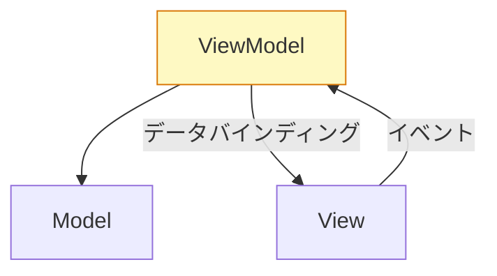

# MVVM（Model-View-ViewModel）

View と ViewModel を**データバインディング**で結び、コードで View を操作しないようにするパターン。  
2005年に Microsoft が WPF のために設計。現在は Vue・Angular・SwiftUI・Jetpack Compose の標準的な考え方になっている。

## 構成



| 役割 | 責任 |
|---|---|
| **Model** | データとビジネスロジック（ドメイン層） |
| **ViewModel** | View が表示するための状態（UI State）を保持。コマンドを受け取って Model を操作 |
| **View** | ViewModel の状態を観察して自動更新。ロジックを持たない |

## コード例

### Vue 3（Composition API）

```typescript
// ViewModel に相当 — ビジネスロジックを持ち、状態を公開する
const useUserForm = () => {
    const name = ref('');
    const email = ref('');
    const isLoading = ref(false);

    const submit = async () => {
        isLoading.value = true;
        await userApi.create({ name: name.value, email: email.value });
        isLoading.value = false;
    };

    return { name, email, isLoading, submit };
};
```

```vue
<!-- View — 状態を観察して表示。ロジックなし -->
<template>
  <input v-model="name" />
  <input v-model="email" />
  <button @click="submit" :disabled="isLoading">送信</button>
</template>

<script setup>
const { name, email, isLoading, submit } = useUserForm();
</script>
```

### Android（Jetpack ViewModel）

```kotlin
// ViewModel — Android の ViewModel は画面回転でも生き残る
class LoginViewModel(private val authRepo: AuthRepository) : ViewModel() {
    val uiState: StateFlow<LoginUiState> = MutableStateFlow(LoginUiState())

    fun login(email: String, password: String) {
        viewModelScope.launch {
            _uiState.update { it.copy(isLoading = true) }
            authRepo.login(email, password)
                .onSuccess { _uiState.update { it.copy(isSuccess = true) } }
                .onFailure { _uiState.update { it.copy(error = it.message) } }
        }
    }
}
```

```kotlin
// Compose の View — State を観察して自動再描画
@Composable
fun LoginScreen(viewModel: LoginViewModel) {
    val state by viewModel.uiState.collectAsState()

    TextField(value = state.email, onValueChange = { viewModel.updateEmail(it) })
    Button(onClick = { viewModel.login() }) { Text("ログイン") }
}
```

## MVP との違い

MVP では Presenter が `view.showError()` のように View のメソッドを呼ぶ（Push型）。  
MVVM では ViewModel が状態を公開し、View が自分でそれを観察する（Pull型）。ViewModel は View の存在を知らない。

```
MVP: Presenter → view.showError("...")   ← Viewインターフェースへの依存が残る
MVVM: ViewModel.uiState = Error(...)     ← Viewについて何も知らない
```

## なぜ存在するか

データバインディングが確立された環境では、Presenter が View のメソッドを呼び出す MVP より、状態を公開するだけの ViewModel の方がシンプルになる。「状態が変われば View が自動更新される」という宣言的UIとの相性が良い。

## いつ使うか

- Vue・Angular・SwiftUI・Jetpack Compose（データバインディングが組み込まれているフレームワーク）
- ViewModel はフレームワーク非依存で書けるため、ユニットテストが容易
- 宣言的UI（状態 → 表示）のパラダイムを採用しているとき

---

## 補足：MVI（Model-View-Intent）

MVVM をさらに厳格にし、状態変化を**単方向の不変フロー**に限定したパターン。

```
View → Intent（ユーザー操作） → Reducer → 新しい State → View
```

Redux・Elm アーキテクチャ・Jetpack Compose の推奨スタイルがこれに近い。状態変化の追跡が容易でデバッグしやすいが、コード量は増える。
