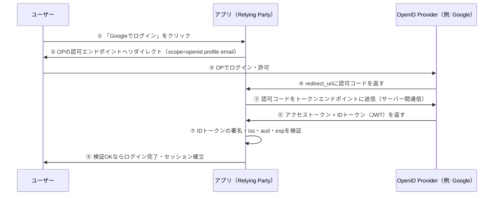

# OpenID Connect（OIDC）

## 何か

OAuth 2.0 の上に**認証レイヤー**を追加したプロトコル。
「このユーザーが誰であるか」を標準化した方法で確認できる。

## なぜ存在するか

OAuth 2.0 は「認可（誰に何を許可するか）」のプロトコルであり、「認証（このユーザーが誰か）」は対象外だった。
そのためサービスごとに独自の認証レイヤーを実装する必要があり、実装のばらつきや脆弱性を生んでいた。
OIDC はその標準解として OAuth 2.0 を拡張する形で2014年に策定された。

## 仕組み（認証フロー）

「Googleでログイン」を例にした流れ。ベースは [OAuth2 の認可コードフロー](/auth/oauth2#認可コードフローauthorization-code-flow) そのもので、そこに `scope=openid` を付けることでIDトークンが追加で発行される。

OAuth2 単体のフローと見た目はほぼ同じだが、⑥で**IDトークンが追加で返ってくる**ことと、それを⑦で**RP（アプリ）自身が検証する**ことがOIDC固有のステップ。アクセストークンは「APIを呼ぶための鍵」、IDトークンは「ユーザー本人であることの証明書」と役割が分かれている。

## IDトークンの検証

IDトークンはJWTなので誰でも内容を読めるが、信頼してよいかはRP側で必ず検証する必要がある。最低限のチェック項目：

| 検証項目 | 確認すること | 怠った場合のリスク |
|---|---|---|
| 署名 | OPの公開鍵で正しく署名されているか | 改ざんされたトークンを信用してしまう |
| `iss` | 想定したOP（発行者）が発行したものか | なりすましOPのトークンを受け入れてしまう |
| `aud` | このアプリ（自分のclient_id）宛のトークンか | 他アプリ向けに発行されたトークンの転用を許してしまう |
| `exp` | 有効期限内か | 古いトークンによるリプレイを許してしまう |

このうち署名検証を省略する実装ミスが特に多い。JWTライブラリは「デコード」と「検証付きデコード」を別関数として提供していることが多く、デコードだけして中身を信用してしまう事故が起きやすい。

## 追加されるもの：IDトークン

OIDC が OAuth 2.0 に追加する最大の要素は **ID トークン**（JWT形式）。

アクセストークンが「何を許可するか」を表すのに対し、IDトークンは「誰であるか」を表す。

IDトークンに含まれる標準クレーム：

| クレーム | 内容 |
|---|---|
| `sub` | ユーザーの一意識別子 |
| `iss` | トークンの発行者（IdPのURL） |
| `aud` | このトークンの対象アプリ（client_id） |
| `email` | メールアドレス（スコープによって含まれる） |
| `name` | 表示名（スコープによって含まれる） |

## スコープ

OIDCで定義された標準スコープ：

- `openid` — OIDCを使う宣言。IDトークンが返される（必須）
- `profile` — 名前・プロフィール画像などの基本情報
- `email` — メールアドレス

## OAuth 2.0 との違い

| | OAuth 2.0 | OIDC |
|---|---|---|
| 目的 | 認可 | 認証 + 認可 |
| 返されるトークン | アクセストークン | アクセストークン + IDトークン |
| ユーザー情報の取得 | 別途APIを呼ぶ | IDトークンに含まれる |

## いつ使うか

- ソーシャルログイン（Google・GitHub・Apple などでサインイン）
- 社内の SSO 基盤を構築する
- 複数サービス間でユーザーIDを共有する

「Google でログイン」ボタンの裏側は OIDC。OAuth 2.0 だけでは「誰がログインしたか」を標準的な方法で知ることができない。
