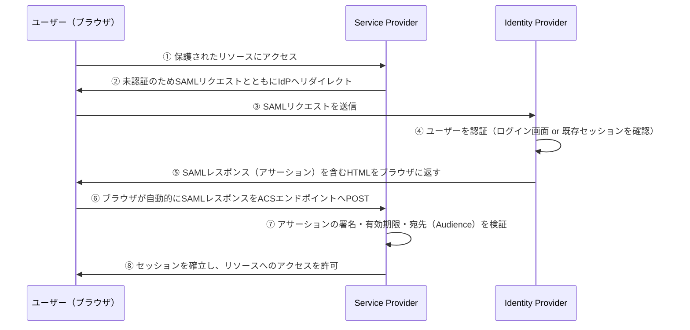

# SAML（Security Assertion Markup Language）

## 何か

XMLベースのSSO（シングルサインオン）標準プロトコル。
エンタープライズ環境で広く使われ、1つの認証で複数のサービスにアクセスできるようにする。

## なぜ存在するか

2000年代初頭、エンタープライズシステムでは社員が複数のサービスに個別ログインする必要があった。
SAML はこれを解決するため SAML 1.0（2002年）・SAML 2.0（2005年）として標準化された。
OIDC より古く、多くのエンタープライズSaaSやオンプレミスシステムが対応している。

## 登場人物

| 用語 | 役割 | 例 |
|---|---|---|
| Identity Provider（IdP） | ユーザーを認証する側 | Okta・Azure AD・Google Workspace |
| Service Provider（SP） | サービスを提供する側 | Salesforce・Slack・社内システム |

## 仕組み（SP-initiated SSO）

最も一般的な「ユーザーがまずサービス側のURLにアクセスする」パターンの流れ。

ポイントは、IdPからSPへアサーションが直接送られるのではなく、**ブラウザを経由してリレーされる**こと。⑤〜⑥はブラウザが自動送信するHTMLフォーム（HTTP POST Binding）として実装されることが多く、ユーザーからは一瞬のリダイレクトに見える。

SPの⑦の検証が手薄だと、改ざんされたアサーションやリプレイ攻撃を受け入れてしまう。署名検証・有効期限・Audience（このアサーションがどのSP向けに発行されたか）の3点は最低限チェックすべき項目。

## アサーションの中身

アサーションは「IdPがこのユーザーについて保証する内容」を記述したXML文書で、主に3つの要素を持つ。

| 要素 | 内容 |
|---|---|
| `Subject` | 誰についての保証か（ユーザーID・メールアドレスなど） |
| `Conditions` | いつまで・どのSP（Audience）向けに有効か |
| `AttributeStatement` | 付随する属性（グループ所属・部署など） |

XML全体はIdPの秘密鍵で署名されており、SPはIdPの公開鍵（メタデータで事前共有）で署名を検証する。

## OIDCとの比較

| | SAML | OIDC |
|---|---|---|
| データ形式 | XML | JSON（JWT） |
| 登場時期 | 2002年 | 2014年 |
| 対応環境 | エンタープライズ・オンプレ | Web・モバイル |
| 実装の複雑さ | 高い（XML署名・検証） | 低い |
| 向いている場面 | 社内システム・SaaSのSSO | ソーシャルログイン・新規開発 |

## いつ使うか

- 社内のSaaSツール（Salesforce・Workdayなど）とIdPを連携するSSO
- 既存のエンタープライズIdP（Azure AD・Oktaなど）と繋ぐ
- オンプレミスシステムへのSSOが必要な場面

新規開発なら OIDC が推奨。SAMLは既存エンタープライズ基盤に繋ぐ必要があるときに使う。
