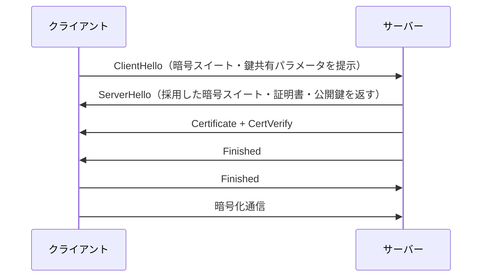

# TLS（Transport Layer Security）

## なぜ存在するか

HTTPは平文通信のため、通信経路上で盗聴・改ざん・なりすましができてしまう。TLSはこれを防ぐために暗号化・完全性検証・サーバー認証を提供する。HTTPS = HTTP over TLS。

## TLSが保証する3つのこと

| 保証 | 意味 |
|------|------|
| 機密性 | 通信内容を暗号化し、第三者が読めない |
| 完全性 | データが途中で改ざんされていないことを検証 |
| 真正性 | 接続先が本当に主張するサーバーであることを証明 |

## TLSハンドシェイクの流れ（TLS 1.3）



TLS 1.3 では1.5RTTで完了（TLS 1.2は2RTT）。以前接続したサーバーへの再接続は0-RTTも可能。

## 証明書と認証局（CA）

**証明書**（Certificate）：サーバーの公開鍵と「このドメインの所有者である」という情報をセットにしたもの。

**認証局**（CA）：証明書に署名して正当性を保証する機関。Let's Encrypt（無料）・DigiCert・GlobalSign など。

**信頼チェーン**（Chain of Trust）
```
ルートCA（OS・ブラウザに組み込み）
  └→ 中間CA
       └→ サーバー証明書
```
ブラウザはルートCAを信頼しているため、そこから連なる証明書を自動的に信頼する。

## mTLS（相互TLS）

通常のTLSはサーバーだけが証明書を提示する。mTLSはクライアントも証明書を提示し、**双方向で認証**する。

**使いどころ**
- マイクロサービス間通信（サービスメッシュ：Istio, Linkerd）
- API クライアントの強認証（特定のデバイス・サービスのみ許可）
- ゼロトラストネットワーク

## TLS 1.2 vs TLS 1.3

| | TLS 1.2 | TLS 1.3 |
|-|---------|---------|
| ハンドシェイク | 2RTT | 1RTT（再接続は0-RTT可） |
| 廃止された暗号 | RC4・MD5など脆弱なものが残存 | 安全でない暗号を削除 |
| 前方秘匿性 | オプション | 必須 |

**前方秘匿性**（Forward Secrecy）：セッションごとに異なる鍵を生成する。秘密鍵が漏洩しても、過去の通信は復号できない。

## SSL との関係

SSL（Secure Sockets Layer）はTLSの前身。SSL 3.0 → TLS 1.0 → ... → TLS 1.3 と進化した。現在SSL 2.0/3.0は廃止。「SSL証明書」という言葉は慣習的に残っているが、実際はTLS証明書。
