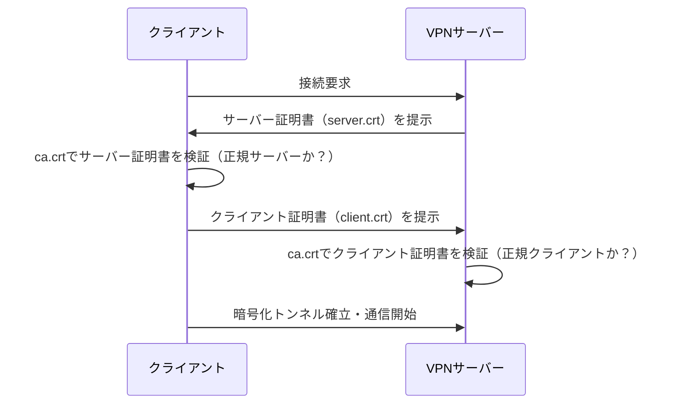

# VPN（Virtual Private Network）

## なぜ存在するか

インターネットは基本的に「誰でも通信を覗ける」公共の網である。社内ネットワークや特定サーバーへ外部から安全にアクセスしたい場合、通信内容を暗号化した「仮想的なプライベートトンネル」をインターネット上に張る必要がある。これがVPN。

## VPNが解決する問題

| 問題 | VPNによる解決 |
|------|---------------|
| 通信の盗聴 | 暗号化トンネルで内容を隠す |
| なりすまし接続 | 証明書・鍵で「正規のクライアント/サーバーか」を相互に確認 |
| プライベートIPへのアクセス | VPNサーバーを踏み台に、内部ネットワークのIPへ到達できる |

## なぜ証明書（RSAキー）が必要なのか

VPNは「暗号化されたトンネルを張る」だけでは不十分で、**「接続してきた相手が本当に正規のクライアントか」を確認する認証**が必要。

認証なしのトンネルは「鍵のかかっていないトンネル」と同じで、誰でも入れてしまう。

OpenVPNはこの認証にTLS（HTTPS等で使われるのと同じ仕組み）を使うため、TLSと同じく **X.509証明書 + RSA/EC鍵ペア**が必要になる。

```
┌─────────────────────────────────────────────────────┐
│  インターネット（公共の網）                           │
│                                                     │
│  クライアント ──── 暗号化トンネル（TLS） ──── VPNサーバー │
│                                                     │
│  ↑ここで「お前は正規のクライアントか？」を証明書で確認 │
└─────────────────────────────────────────────────────┘
```

## 鍵・証明書ファイルの役割

OpenVPNを例にすると、以下のファイルが登場する。

| ファイル | 種類 | 役割 |
|---------|------|------|
| `ca.crt` | CA証明書 | 発行元（認証局）の公開証明書。「このCAが署名した証明書は信頼する」という基準 |
| `server.crt` | サーバー証明書 | サーバーの身元を証明。CAが署名している |
| `server.key` | サーバー秘密鍵 | サーバーだけが持つ。外部に漏れてはいけない |
| `client.crt` | クライアント証明書 | クライアントの身元を証明。CAが署名している |
| `client.key` | クライアント秘密鍵 | クライアントだけが持つ |

**RSAとは何か：** 証明書の中で使われている公開鍵暗号の1方式。「RSAキー」と言われたら「証明書に使う鍵ペアの種類がRSA」という意味。

## SSH鍵との違い

混乱しやすいが、SSH鍵（`id_rsa` / `id_rsa.pub`）とVPN証明書は別物。

| | SSH鍵 | VPN証明書（OpenVPN） |
|--|-------|---------------------|
| 形式 | `id_rsa`（秘密鍵）/ `id_rsa.pub`（公開鍵） | `.key`（秘密鍵）/ `.crt`（証明書＝公開鍵+署名） |
| 認証局（CA） | 不要（公開鍵を直接サーバーに登録） | 必要（CAがクライアント証明書を署名・発行） |
| 用途 | サーバーへのログイン | VPNトンネルの確立・相互認証 |

共通点：どちらもRSA等の公開鍵暗号を使い、**秘密鍵は手元に置き、公開側（.pubや.crt）を相手に渡す**という構造は同じ。

## OpenVPNの接続フロー



双方が証明書を提示して確認し合うこれを**mTLS（相互TLS認証）**と呼ぶ。

## VPNの種類

| 種類 | 代表例 | 特徴 |
|------|--------|------|
| SSL/TLS VPN | OpenVPN | TLS上で動作。証明書認証。ファイアウォールを通過しやすい |
| IPsec VPN | IKEv2, L2TP/IPsec | OSIのL3で動作。OS組み込みが多い |
| WireGuard | WireGuard | 新世代。シンプルな設定・高速。公開鍵認証のみ |

## 関連

- [TLS](./tls) — OpenVPNが内部で使っているハンドシェイクの仕組み
- [VPC / サブネット](./vpc-subnet) — VPN接続後にアクセスするプライベートネットワークの設計
