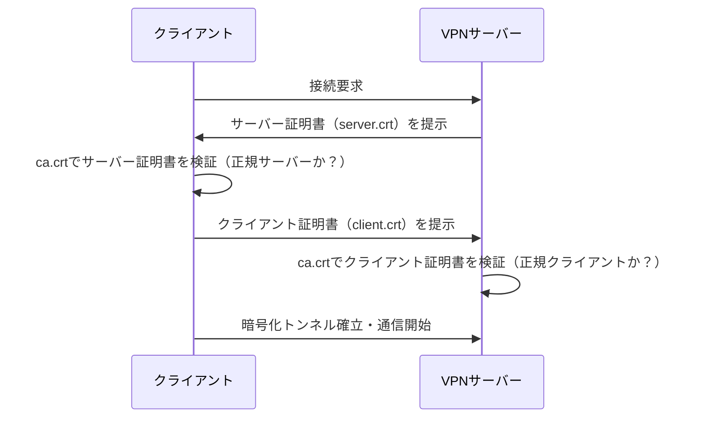
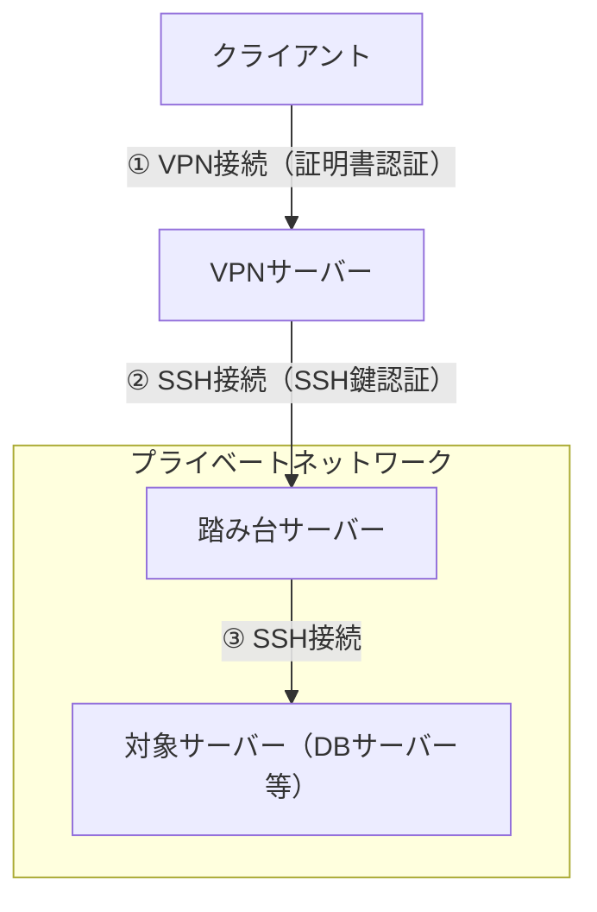

# VPN（Virtual Private Network）

## なぜ存在するか

インターネットは基本的に「誰でも通信を覗ける」公共の網である。社内ネットワークや特定サーバーへ外部から安全にアクセスしたい場合、通信内容を暗号化した「仮想的なプライベートトンネル」をインターネット上に張る必要がある。これがVPN。

## VPNが解決する問題

| 問題 | VPNによる解決 |
|------|---------------|
| 通信の盗聴 | 暗号化トンネルで内容を隠す |
| なりすまし接続 | 証明書・鍵で「正規のクライアント/サーバーか」を相互に確認 |
| プライベートIPへのアクセス | VPNサーバーを踏み台に、内部ネットワークのIPへ到達できる |

## なぜ証明書（RSAキー）が必要なのか

VPNは「暗号化されたトンネルを張る」だけでは不十分で、**「接続してきた相手が本当に正規のクライアントか」を確認する認証**が必要。

認証なしのトンネルは「鍵のかかっていないトンネル」と同じで、誰でも入れてしまう。

SSL/TLS VPNはこの認証にTLS（HTTPS等で使われるのと同じ仕組み）を使うため、TLSと同じく **X.509証明書 + RSA/EC鍵ペア**が必要になる。


## 鍵・証明書ファイルの役割

SSL/TLS VPN（証明書認証方式）では、以下のファイルが登場する。

| ファイル | 種類 | 役割 |
|---------|------|------|
| `ca.crt` | CA証明書 | 発行元（認証局）の公開証明書。「このCAが署名した証明書は信頼する」という基準 |
| `server.crt` | サーバー証明書 | サーバーの身元を証明。CAが署名している |
| `server.key` | サーバー秘密鍵 | サーバーだけが持つ。外部に漏れてはいけない |
| `client.crt` | クライアント証明書 | クライアントの身元を証明。CAが署名している |
| `client.key` | クライアント秘密鍵 | クライアントだけが持つ |

**RSAとは何か**： 証明書の中で使われている公開鍵暗号の1方式。「RSAキー」と言われたら「証明書に使う鍵ペアの種類がRSA」という意味。

## SSH鍵との違い

混乱しやすいが、SSH鍵（`id_rsa` / `id_rsa.pub`）とVPN証明書は別物。

| | SSH鍵 | VPN証明書（SSL/TLS VPN） |
|--|-------|---------------------|
| 形式 | `id_rsa`（秘密鍵）/ `id_rsa.pub`（公開鍵） | `.key`（秘密鍵）/ `.crt`（証明書＝公開鍵+署名） |
| 認証局（CA） | 不要（公開鍵を直接サーバーに登録） | 必要（CAがクライアント証明書を署名・発行） |
| 用途 | サーバーへのログイン | VPNトンネルの確立・相互認証 |

共通点：どちらもRSA等の公開鍵暗号を使い、**秘密鍵は手元に置き、公開側（.pubや.crt）を相手に渡す**という構造は同じ。

## VPNの接続フロー（証明書認証）



双方が証明書を提示して確認し合うこれを**mTLS**（相互TLS認証）と呼ぶ。

## VPNの種類

| 種類 | 代表例 | 特徴 |
|------|--------|------|
| SSL/TLS VPN | OpenVPN | TLS上で動作。証明書認証。ファイアウォールを通過しやすい |
| IPsec VPN | IKEv2, L2TP/IPsec | OSIのL3で動作。OS組み込みが多い |
| WireGuard | WireGuard | 新世代。シンプルな設定・高速。公開鍵認証のみ |

## 踏み台（バスティオンホスト）経由の接続

### なぜ踏み台が必要か

プライベートネットワーク内のサーバーはインターネットから直接到達できない。VPNで内部ネットワークに入った後、さらにそのサーバーへSSHで接続するために中継役が必要になる。この中継サーバーを**踏み台**（バスティオンホスト）と呼ぶ。



### 接続の2段階

| 段階 | プロトコル | 認証 |
|------|-----------|------|
| ① クライアント → VPNサーバー | VPN（TLS等） | 証明書（RSAキー） |
| ② クライアント → 踏み台 | SSH | SSH鍵（`id_rsa` / `id_ed25519`） |
| ③ 踏み台 → 対象サーバー | SSH | SSH鍵 |

### なぜ踏み台を挟むか

- 対象サーバーをインターネットに直接さらさず、攻撃面を踏み台1台に集中させられる
- 踏み台への接続ログを一元管理できる（誰がいつどのサーバーに入ったか）
- 対象サーバー側にSSH公開鍵を配る範囲を内部に限定できる

### SSH ProxyJump（ローカルで透過的に接続する方法）

踏み台を経由して対象サーバーに直接接続しているように見せる設定。`~/.ssh/config` に書く。

```
Host bastion
  HostName <踏み台のIP>
  User <ユーザー名>
  IdentityFile ~/.ssh/id_ed25519

Host target
  HostName <対象サーバーのプライベートIP>
  User <ユーザー名>
  ProxyJump bastion
  IdentityFile ~/.ssh/id_ed25519
```

`ssh target` と打つだけで、踏み台を透過的に経由して対象サーバーに接続できる。

## 関連

- [TLS](./tls.md) — SSL/TLS VPNが内部で使っているハンドシェイクの仕組み
- [VPC / サブネット](./vpc-subnet.md) — VPN接続後にアクセスするプライベートネットワークの設計
