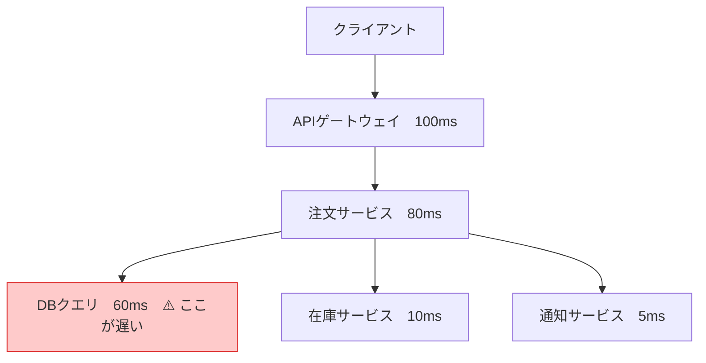

# 分散トレーシング

## 何か

マイクロサービス環境で「1つのリクエストが複数のサービスをどのように通過したか」を記録・可視化する仕組み。
どのサービスで遅延が発生しているか・どこでエラーが起きたかを特定できる。

## なぜ必要か

モノリスでは1プロセスのスタックトレースを見ればよかった。
マイクロサービスでは、1つのAPIリクエストが数十のサービスを経由するため、どこで何が起きたかを単一のログでは追えない。



## スパンとトレース

- **スパン**: 1つの操作単位（「DBクエリ」「外部API呼び出し」など）
- **トレース**: スパンが木構造に連なったもの = 1リクエストの全経路

各スパンは `trace_id`（トレース全体の識別子）と `span_id`（スパン個別の識別子）を持つ。

## コンテキスト伝搬

`trace_id` をサービス間で引き継ぐ仕組み。HTTPヘッダーに乗せて次のサービスへ渡す。

W3C が標準化した `traceparent` ヘッダーを使うのが現在のスタンダード（W3C TraceContext）。

```
traceparent: 00-4bf92f3577b34da6a3ce929d0e0e4736-00f067aa0ba902b7-01
              │  └─ trace_id（128bit）               └─ span_id   └─ flags
              └─ version
```

OpenTelemetry SDK はこのヘッダーの付与・読み取りを自動で行う。

## サンプリング戦略

全トレースを記録するとデータ量とコストが膨大になる。サンプリングで間引く。

出典: [OpenTelemetry Sampling](https://opentelemetry.io/docs/concepts/sampling/)

### ヘッドサンプリング（Head-Based Sampling）

リクエストの**開始時点**でサンプリングするかどうかを決める。

```
リクエスト到着 → [サンプリング判定: 5%] → 記録 or 破棄
```

- **メリット**: シンプルで設定が簡単
- **デメリット**: エラーが起きたトレースだけを必ず記録する、といった条件が使えない

### テールサンプリング（Tail-Based Sampling）

トレース全体が完了した**後**にサンプリングするかどうかを決める。

```
全スパン収集 → [条件判定: エラーあり? 遅延 > 1s?] → 記録 or 破棄
```

- **メリット**: 「エラーを含むトレースは必ず記録」「p99以上のトレースだけ保存」などが可能
- **デメリット**: 全スパンを一時保持する必要があり、実装・運用が複雑

## Jaeger

分散トレーシングのバックエンド。OpenTelemetry Collector のフレームワーク上に構築されており、OTLPでトレースを受け取る。

出典: [Jaeger Architecture](https://www.jaegertracing.io/docs/2.6/architecture/)

```
[アプリ（OTel SDK）]
    └→ [Jaeger Collector] → [ストレージ（Elasticsearch 等）]
                                    ↑
                            [Jaeger Query（UI）]
```

主要な役割：
- **Collector**: アプリからトレースを受け取り、ストレージへ書き込む
- **Query**: UIとAPIを提供してトレースを検索・可視化
- **All-in-one**: 小規模環境向け。CollectorとQueryを1プロセスで動かす

## いつ使うか

- マイクロサービスが3つ以上あり、サービス間の依存関係が複雑になってきた
- 「どのサービスがレスポンスを遅くしているか」の調査に時間がかかっている
- 障害時に原因サービスの特定が困難

## いつ使わないか

- モノリシックなアプリケーション → 通常のスタックトレースとログで十分
- インフラの死活監視が主目的 → Zabbix
