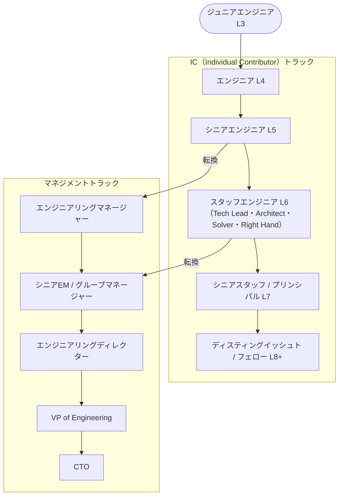

# エンジニアリングロール

ソフトウェアエンジニアのキャリアには大きく2つのトラックがある。**IC（Individual Contributor）** と **EM（Engineering Manager）**。どちらが上下ではなく、貢献の仕方が異なる並列のキャリアパス。

## キャリアパス全体像

正解のない部分も多いが、一般的なイメージは以下の通り。Senior 前後がトラックの分岐点になることが多い。

## IC（Individual Contributor）

マネジメントを持たず、技術的な貢献で価値を出すロール。コード・設計・技術判断が主な仕事。

### ICのレベル

一般的な職位は会社によって名称が異なるが、大まかな構造は共通している。

| レベル | 典型的な呼称 | スコープ |
|---|---|---|
| L3-L4 | Software Engineer | タスク・機能単位 |
| L5 | Senior Software Engineer | チーム内の技術課題 |
| L6 | Staff Engineer | 複数チームにまたがる技術課題 |
| L7 | Senior Staff / Principal Engineer | 部門・プロダクト全体 |
| L8+ | Distinguished / Fellow | 会社・業界レベル |

Senior Engineer までは多くの会社が共通して持つが、**Staff 以上は「シニアの先」として設けている会社とそうでない会社がある**。

### 各レベルに求められること

レベルを分ける軸は「自律性・スコープ・曖昧さへの対処・他者への影響力」の4つ。

**L3（Entry-level / Junior）**
- 明確に定義されたタスクを、指示を受けながら完遂する
- 不明点は積極的に質問し、フィードバックを吸収して成長することが期待される
- コードを書く技術を習得しつつ、チームの開発プロセスに慣れる段階

**L4（Engineer）**
- 機能単位のタスクを自律的に完遂できる
- 問題が起きたとき、自分で調査・解決の糸口を見つけてから相談できる
- 「動くコードを書く」から「チームにとって良いコードを書く」への移行期

**L5（Senior Engineer）**
- 機能全体・サービス単位の設計と実装を自律的に進められる
- 問題を自分で発見し、解決策を提案できる（言われたことだけやる段階を超える）
- ジュニアのメンタリング・コードレビューで品質を底上げする
- 多くの会社で「一人前」の基準となるレベル

**L6（Staff Engineer）**
- チームをまたぐ技術課題（システム間の整合性・共通基盤・負債解消）に取り組む
- 答えが明確でない曖昧な問題を、自分でスコープ定義から始められる
- 直接コードを書かなくても、設計・レビュー・意思決定を通じて大きな成果を出す

**L7以上（Principal / Senior Staff / Distinguished）**
- 部門・会社全体の技術方向性に影響を持つ
- 数年先を見越した技術投資の判断に関わる
- 外部（業界・コミュニティ）への影響も期待されることがある

## EM（Engineering Manager）

チームの成果・メンバーの成長・採用・プロセスに責任を持つロール。コードを書かなくなる場合もあるが、技術的な判断は引き続き行う。

| レベル | 典型的な呼称 | スコープ |
|---|---|---|
| - | Engineering Manager | 1チーム（6〜10人程度） |
| - | Senior EM / Group Manager | 複数チーム |
| - | Engineering Director | 複数グループ・プロダクト |
| - | VP of Engineering | 組織全体の技術部門 |
| - | CTO | 会社全体の技術戦略 |

## Staff Engineer とは

Staff Engineer は「Senior の次」にあたる IC の上位職。**マネジメントなしに広範囲に技術的影響力を持つ**ことが期待される。

Will Larson の書籍 *Staff Engineer*（2021）では、4つのアーキタイプが定義されている。

### 4つのアーキタイプ

**Tech Lead（テックリード）**
- チームの技術方向を導く
- 最も一般的な Staff の形。チームと密接に働く
- コードも書くが、設計・レビュー・判断に多くの時間を使う

**Architect（アーキテクト）**
- 特定のドメイン（決済・認証・インフラなど）の技術戦略に責任
- チームをまたいで動くが、特定領域の深い専門性が求められる

**Solver（ソルバー）**
- 組織内の難しい問題を次々と解決していくロール
- チームには属さず、重要な課題に一時的にアサインされる

**Right Hand（ライトハンド）**
- VP や CTO などの意思決定者の技術的な分身として動く
- 承認者ではなく、複雑な判断を一緒に考えるパートナー

どのアーキタイプも「コードを書かない上位職」ではなく、**コードを書く割合は減るが、技術的な深さは維持**することが求められる。

## IC と EM の選択

| 観点 | IC | EM |
|---|---|---|
| 主な成果 | 技術的な問題解決・設計 | チームの成果・メンバーの成長 |
| 1日の仕事 | コーディング・レビュー・設計 | 1on1・採用・ロードマップ調整 |
| 影響範囲の広げ方 | 技術的判断・メンタリング・設計文書 | チーム編成・プロセス・採用 |
| 向いている人 | 技術課題そのものに価値を感じる | 人の成長・チームの成果に価値を感じる |

マネジメントへの移行は**一方通行ではない**。IC → EM → IC の往復は一般的で、両方の経験を持つエンジニアは評価されることが多い。

## FDE（Forward Deployed Engineer）

顧客の現場に常駐・密着し、ソフトウェアのデプロイ・カスタマイズ・問題解決を直接行うエンジニアロール。  
Palantir が政府・防衛機関向けに展開するモデルとして広めた。近年は OpenAI・Anduril・Scale AI などの AI カンパニーが採用し注目度が上がっている。

### 通常のエンジニアとの違い

| 観点 | 通常のプロダクトエンジニア | FDE |
|---|---|---|
| 仕事場 | 社内・リモート | 顧客のオフィス・現場 |
| 対話相手 | チームメンバー・PM | 顧客の担当者・現場ユーザー |
| アウトプット | 全ユーザー向けのプロダクト機能 | 特定顧客向けのデプロイ・カスタマイズ・統合 |
| 求められるスキル | 技術力 | 技術力 ＋ コミュニケーション ＋ コンサルティング的判断 |

### なぜ存在するか

複雑なエンタープライズソフトウェアや AI システムは、「デプロイして終わり」にならない。  
顧客の業務・データ・既存システムに深く統合する必要があり、現場に人を置いて対話しながら作り込むことが最速になるケースがある。

特に AI の文脈では、LLM をエンタープライズに導入する際の「プロンプト設計・既存データとの接続・ワークフロー統合」を担う役割として FDE の需要が急増している。

### 他のロールとの関係

- **Solutions Engineer / Sales Engineer** — 商談・プリセールス寄り。FDE はより実装・運用寄り
- **Customer Success Engineer** — 既存顧客のサポート寄り。FDE はより能動的にシステムを作る
- **コンサルタント** — 提言が中心。FDE は自分でコードを書いて動かす点が異なる

日本の SIer の SE（システムエンジニア）と概念が近い部分もあるが、FDE はプロダクト会社に所属し自社ソフトウェアを展開する点が異なる。

## 定義がブレやすいポジション

タイトルが会社によって意味が異なるポジションがある。求人票や会話の中で出てきたとき、文脈で判断する必要がある。

### Tech Lead（テックリード）

**タイトルではなくロール（責任）として使われることが多い。**

チームの技術方向を主導する責任を指す。Senior Engineer が担う場合も、Staff Engineer が担う場合もある。直属の部下は持たない（EM との違い）。

- 正式なタイトルとして存在する会社：「Tech Lead」が職位として定義されている
- ロールとして存在する会社：「Staff Engineer として Tech Lead アーキタイプを担う」という形

Staff Engineer の4アーキタイプのうち「Tech Lead」と同名であるのは偶然ではない。Staff レベルに達したエンジニアが自然と担う責任の形の1つ。

### Principal Engineer（プリンシパルエンジニア）

**Staff の上か、Staff と同義か、会社によって異なる。**

| 会社の例 | Principal の位置づけ |
|---|---|
| Amazon | Senior → Principal → Distinguished（Staff は使わない） |
| Spotify・多くのスタートアップ | Staff と Principal がほぼ同義 |
| Google | Staff → Senior Staff → Principal → Distinguished → Fellow |
| 日本の多くの企業 | そもそもこの区分がない |

「Principal と Staff どちらが上か」は会社のレベル定義を確認するしかない。共通しているのは「複数チームにまたがる技術的影響力を持つ上位 IC」という期待値。

### VPoE（VP of Engineering）と CTO の違い

どちらも技術組織の上位職だが、責任の重心が異なる。

| 観点 | VP of Engineering | CTO |
|---|---|---|
| 主な責任 | チームの実行力・組織運営・採用・プロセス | 技術戦略・プロダクト方向性・外部への技術的な顔 |
| 向いている人 | EM として実績があり、組織を動かすことに価値を感じる | 技術の先端を追い、ビジョンを語ることに価値を感じる |
| 外部との接点 | 少ない | 顧客・投資家・採用候補者への技術説明が多い |

小規模な組織では1人が両方を担うことが一般的。会社が成長すると役割が分化し、「CTO が技術ビジョンを描き、VPoE が実行する」という分担になることが多い。

## 会社による違い

- **FAANG系（Google・Meta・Amazon）** はレベル制（L3〜L8+）が明確で Staff 以上のロールが整備されている
- **スタートアップ** はレベルが曖昧で、CTO が IC 兼任のまま組織が成長することも多い
- **日本の事業会社** は技術職・マネージャー職という2区分のみで Staff 相当のロールがないことも多い
