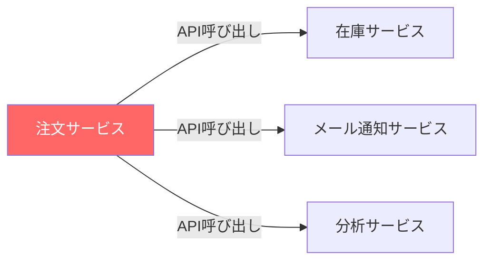
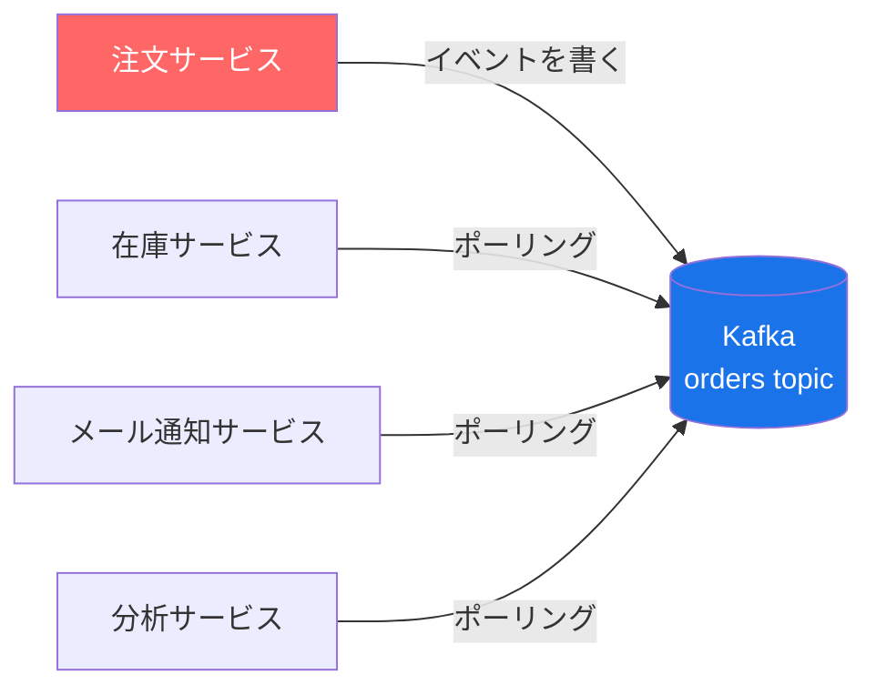
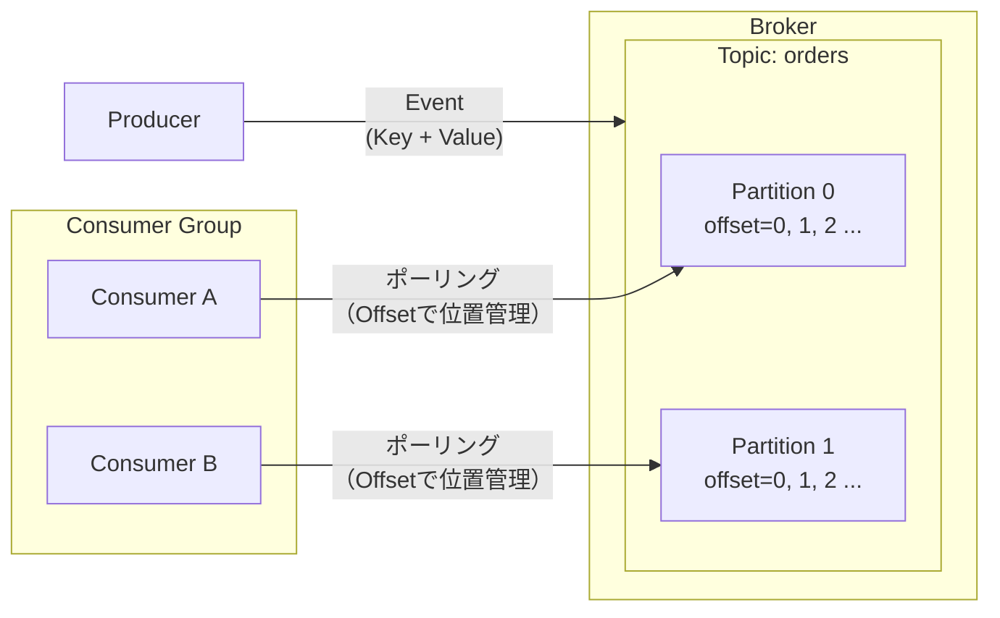
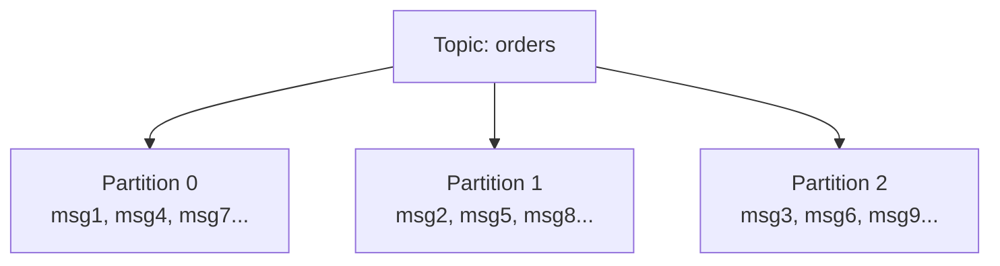
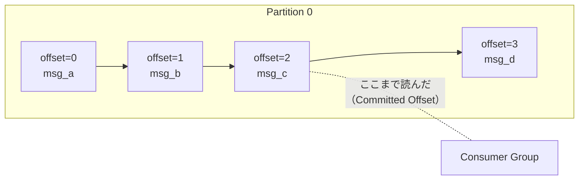
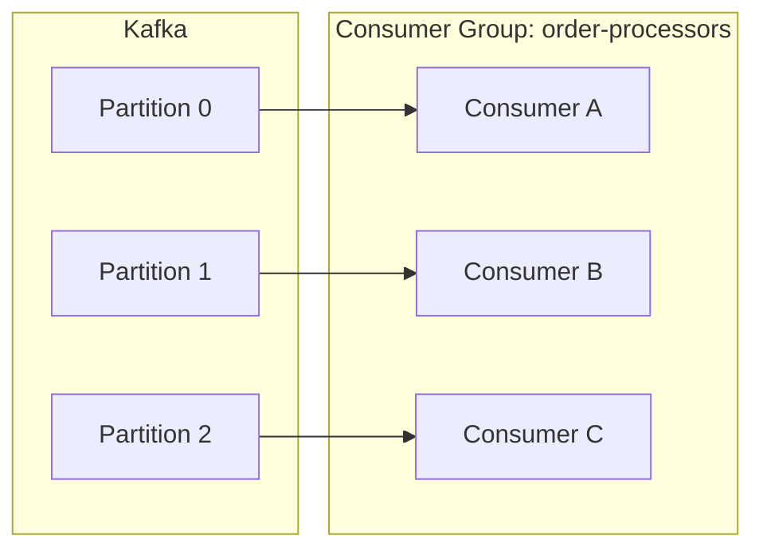
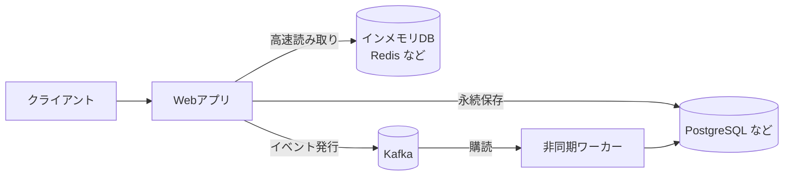

# Apache Kafka

Apache Software Foundationが管理するオープンソースのイベントストリーミングプラットフォーム。もともとLinkedInが社内の膨大なデータパイプライン問題を解決するために開発し、2011年にOSSとして公開された。

公式の定義では以下の3つの機能を1つに統合したプラットフォームとされている。

1. イベントのストリームを**発行・購読**する
2. イベントを**永続的に保存**する
3. イベントを**リアルタイムまたは遡って処理**する

## なぜ存在するか

サービスが複数に分かれると「Aが起きたらBとCとDを動かす」という処理をAPI呼び出しで繋ぐと問題が起きる。



- BやCが落ちていたら処理が失われる
- Aは全員の応答を待たされる
- 新しいサービスEを追加するたびにAを修正しなければならない

Kafkaはこれを「イベントログ」という形で解決する。Aはログに書くだけで、BもCもDも自分のペースでログを読む（PULL型）。



各サービスはKafkaに能動的にポーリングしに行く。Kafka側からプッシュはしない。各サービスが独立したポーリングループを持つため、処理速度や障害が互いに影響しない。

## 主要コンポーネントの全体像



## 主要コンポーネント

### Event（イベント）

Kafkaにおける最小単位。「何かが起きた」という事実を記録したもの。

| 要素 | 説明 | 例 |
|---|---|---|
| Key | 識別子。同じKeyは同じPartitionに送られる | `"user-001"` |
| Value | メッセージの本体 | `{"action": "purchase", "amount": 3000}` |
| Timestamp | イベントが発生した時刻 | `2026-05-03T12:00:00Z` |
| Headers | 任意のメタデータ | トレースID など |

### Topic

イベントを格納する名前付きのログ。「orders」「user-events」など用途ごとに作る。

- 消費後もイベントは残り、保持期間（デフォルト7日）まで保存される
- 1つのTopicに複数のProducerが書き込め、複数のConsumerが独立して読める

### Partition

Topicを分割した単位。並列処理とスケールアウトのために使う。

- 同じKeyのイベントは常に同じPartitionに入る → Partition内での順序が保証される
- Partitionが多いほど並列処理の上限が上がる



### Offset

各Partitionにおける「どこまで読んだか」を示す連番。Kafkaがグループごとに管理するため、Consumerが落ちても再起動後に続きから読める。



### Consumer Group

複数のConsumerをグループにまとめて、Partitionを分担して処理する仕組み。同じGroup内では1つのPartitionを1つのConsumerだけが担当する。

- **同じGroup**: Partitionを分担して並列処理（スループット向上）
- **別のGroup**: 同じTopicを独立して読める（例：処理用とログ分析用で別々に購読）



### Broker

Kafkaクラスターを構成するサーバープロセス。イベントの保存と配信を担う。これがKafkaの本体。

Kafka自体がストレージを持つため外部のDBは必要ない。イベントはBrokerのディスク上にログファイルとして書き込まれる。

## コアAPI

| API | 役割 |
|---|---|
| Producer API | イベントをTopicに発行する |
| Consumer API | TopicのイベントをポーリングしてPULLする |
| Kafka Streams API | ストリーム処理アプリケーションを構築する |
| Kafka Connect API | 外部システム（DB・ファイル等）と双方向に連携する |
| Admin API | Topic・Brokerの管理操作 |

## 他のツールとの比較

| | Redis Pub/Sub | Redis Streams | RabbitMQ | Kafka |
|---|---|---|---|---|
| 永続性 | なし（揮発） | メモリ依存 | ディスク | **ディスク** |
| 読後のメッセージ | 消える | 手動削除が必要 | 消える | **残る** |
| 複数の受信者 | 全員に届く（不在なら消える） | Consumer Groupで分担 | 競合して1つが取る | **全員が独立して読める** |
| 再処理 | 不可 | 限定的 | 不可 | **できる（Offset指定）** |
| スループット | 高い | 中程度 | 中程度 | **非常に高い** |
| 主な用途 | リアルタイム通知 | 軽量なイベントログ | ジョブキュー | **イベントログ・ストリーム処理** |

Kafkaの最大の特徴は「読んでもメッセージが消えない」点。障害後の再処理や、複数サービスが同じイベントを独立して処理するユースケースに強い。

## Kafkaでできないこと

**キャッシュとしては使えない。**

Kafkaにはキーで値を直接取り出す仕組みがなく、読み取りは常に「Partitionを順番に読む」形になる。

```
# インメモリDB（Redisなど）なら即座にできる
GET user:001  → "Alice"

# Kafkaでは「user:001の今の値を返せ」という問い合わせができない
```

実際のシステムではKafkaが「イベントの通り道」を担い、データの保管は別のツールに委ねる構成になる。



| ツール | 役割 |
|---|---|
| インメモリDB（Redis など） | 高速な一時保管（キャッシュ・セッション） |
| PostgreSQL など | データの永続保存 |
| Kafka | サービス間のイベント伝達・非同期処理 |

## いつ使うか

- 複数のシステム間でリアルタイムにデータを連携したい
- 高スループット・低レイテンシのイベント処理が必要
- 障害後の再処理や、過去に遡ったイベント処理が必要
- マイクロサービス間を疎結合な非同期通信で繋ぎたい
- 複数のサービスが同じイベントを独立して処理したい
