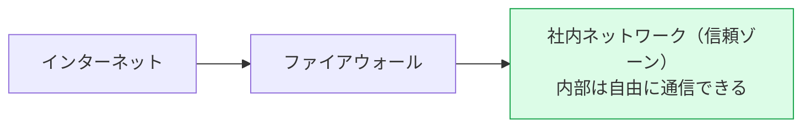
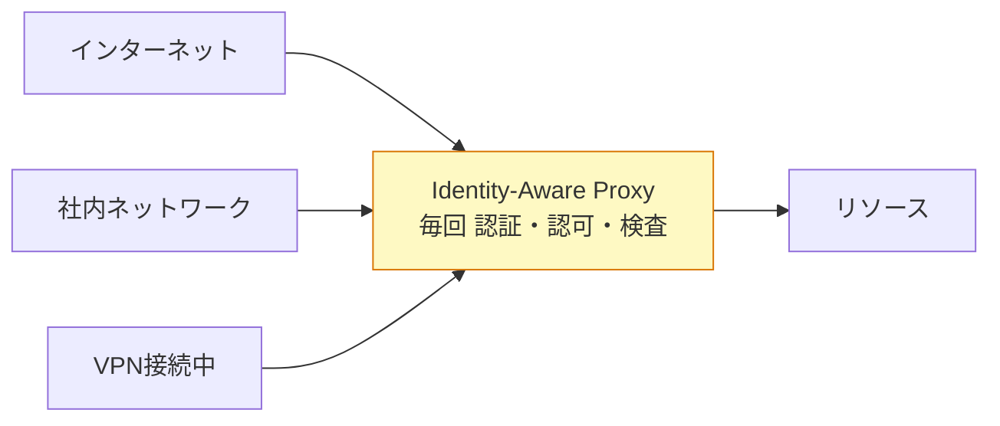
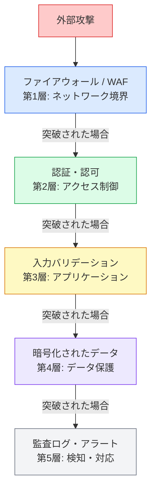

# セキュリティ設計原則

個別の攻撃手法への対策より上位にある、設計レベルのセキュリティ原則。  
「どの脆弱性を防ぐか」より「どういう構造にすればそもそも攻撃されにくいか」を考えるための指針。

## Zero Trust（ゼロトラスト）

**原則：** ネットワークの内側にいるからといって信頼しない。すべてのアクセスを常に検証する。

### 従来モデルとの違い

従来の「境界防御（Perimeter Security）」は城と堀の考え方。社内ネットワーク内のリクエストは信頼し、外部からの侵入を防ぐことに集中した。

**従来モデル（境界防御）**

**Zero Trust**

### なぜコロナ禍で普及したか

境界防御の前提は「社員は会社のオフィス（社内ネットワーク）にいる」。リモートワークの普及でこの前提が崩れた。VPN で社内ネットワークに入れれば何でもできる設計は、VPN 認証情報が漏れた瞬間に全社のリソースが危険にさらされる。

Zero Trust は「どこからアクセスしても同じ厳しさで検証する」ため、リモート環境と相性がよい。

### 3つの原則

**1. 常に認証・認可する（Never Trust, Always Verify）**  
リクエストのたびにアイデンティティ・デバイスの状態・アクセス権を確認する。一度認証されたセッションを過度に信頼しない。

**2. 最小権限（Least Privilege）**  
必要なリソースへの必要最小限のアクセス権だけを付与する。管理者権限を日常業務で使わない。期限付きアクセスも有効。

**3. 侵害を前提にする（Assume Breach）**  
侵入されることを前提に設計する。侵入されても被害を最小化できる構造（横移動を防ぐ・ログで検知できる）にする。

### 実装例

- **Identity-Aware Proxy** — Google BeyondCorp・Cloudflare Access・Palo Alto Prisma。ネットワーク位置ではなくアイデンティティでアクセスを制御
- **MFA の徹底** — パスワード単体では認証しない
- **マイクロセグメンテーション** — 社内ネットワークを細かく分割し、侵入されても横移動できない設計
- **継続的な監視** — すべてのアクセスをログに記録し、異常を検知できる状態を維持

---

## 多層防御（Defense in Depth）

**原則：** 1つのセキュリティ対策が突破されても、次の層で止められるように複数の防御を重ねる。

単一の防御に依存する設計は、その防御が突破された瞬間に全体が崩壊する。

**いつ使うか：** セキュリティ要件を検討するとき、「この対策が1つ失敗したらどうなるか」を問い続けることで自然と多層防御の設計になる。

---

## 最小権限の原則（Principle of Least Privilege）

**原則：** ユーザー・プロセス・システムに対して、タスクを実行するために必要な最小限の権限だけを付与する。

過剰な権限は、アカウントが侵害されたとき・内部不正が起きたときの被害範囲を拡大する。

**具体的な適用場面：**

| 対象 | 過剰権限の例 | 最小権限の例 |
|---|---|---|
| DB ユーザー | アプリが DB の管理者権限を持つ | READ / WRITE のみ、必要なテーブルだけ |
| IAM ロール | EC2 インスタンスが全 S3 バケットにアクセスできる | 特定バケットへの特定操作のみ |
| 開発者 | 全員が本番 DB に直接アクセスできる | 本番アクセスは申請制・監査ログあり |
| サービス間通信 | サービス A が全サービスを呼べる | 必要なエンドポイントだけを許可 |

Zero Trust の「常に認証・認可する」と組み合わせることで、横移動（Lateral Movement）攻撃への耐性が高まる。
